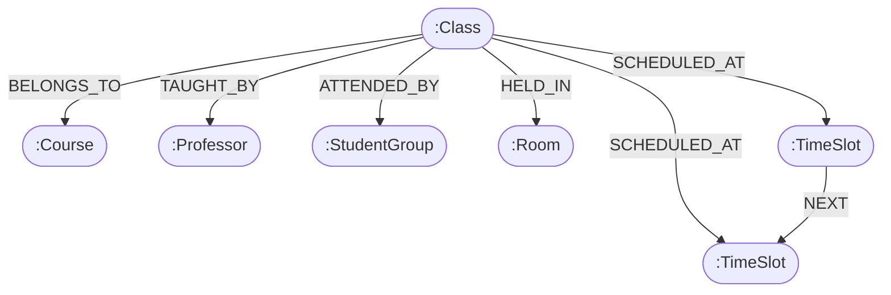
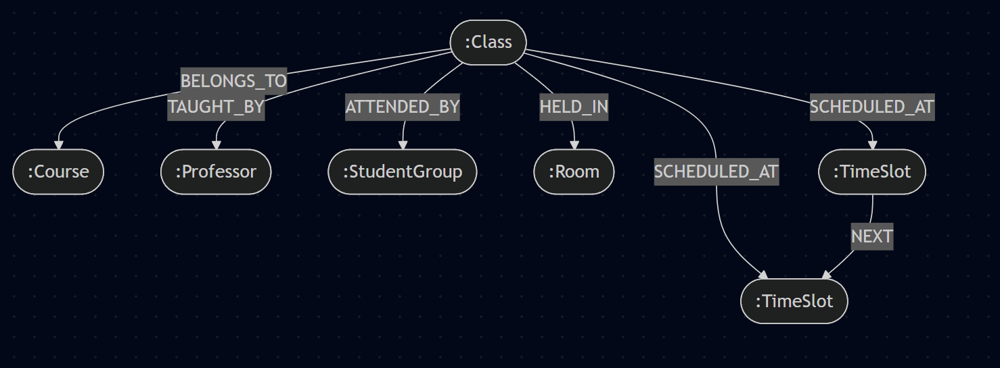

# Graph Entity Relationship Diagram (ERD)
*University Scheduling System - Ephemeral Compute Layer*

## 1. Overview
While the primary "Source of Truth" is stored as a flat JSON file in GitHub, the calculation engine (Memgraph) requires a node-and-edge structure to efficiently execute Cypher queries. This document outlines the Graph ERD and the specific relationships mapped during the "Hydration" phase.

## 2. Graph ERD (Mermaid)

## 3. Key Architectural Decisions & Graph Logic

### Decision 1: The `Class` Node as the Central Hub

* **Logic:** The `Class` node acts as the center of the graph. It holds minimal intrinsic data (mostly IDs and titles) but serves as the connective tissue for all other resources.
* **Rationale:** By making the Class the central hub, queries for scheduling conflicts or resource utilization always originate from or pass through the Class, making traversal paths highly predictable and performant.

### Decision 2: 1:1 Constraints for Resources

* **Logic:** The `TAUGHT_BY`, `ATTENDED_BY`, and `HELD_IN` relationships are strictly one-to-one for any given `Class` instance.
* **Rationale:** This simplifies constraint logic. If two distinct `Class` nodes point to the same `Professor` and the same `TimeSlot`, the system instantly flags a double-booking conflict. No complex cardinality checks are required.

### Decision 3: Direct `SCHEDULED_AT` Connections to Every TimeSlot

* **Logic:** If a class spans multiple periods (e.g., Period 1 and Period 2), the `Class` node creates a direct `SCHEDULED_AT` edge to *each* individual `TimeSlot` node.
* **Rationale:** This avoids complex, deep graph traversals during constraint checking. Instead of querying "Find Slot 1, then traverse the NEXT chain to see if the class overlaps with another event," the query simply asks "Does this class touch this slot directly?" This drastically speeds up conflict detection in the ephemeral environment.

### Decision 4: The Chronological `NEXT` Sequence

* **Logic:** `TimeSlot` nodes are sequentially linked via a `NEXT` relationship (e.g., `(Slot1)-[:NEXT]->(Slot2)`).
* **Rationale:** This specific relationship is reserved entirely for calculating sequential Metrics. It allows Cypher to easily traverse a student's or professor's day to calculate gaps (free periods between classes) or detect back-to-back consecutive classes without relying on integer math or datetime comparisons.
