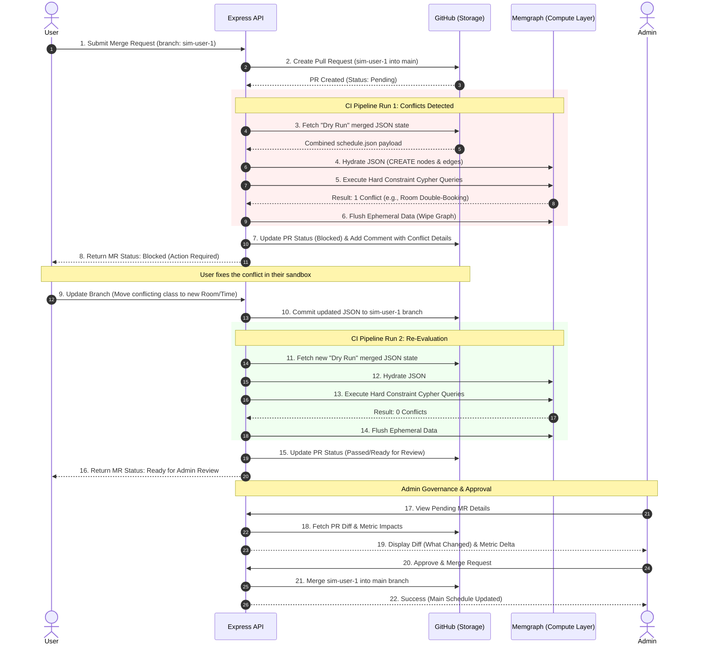
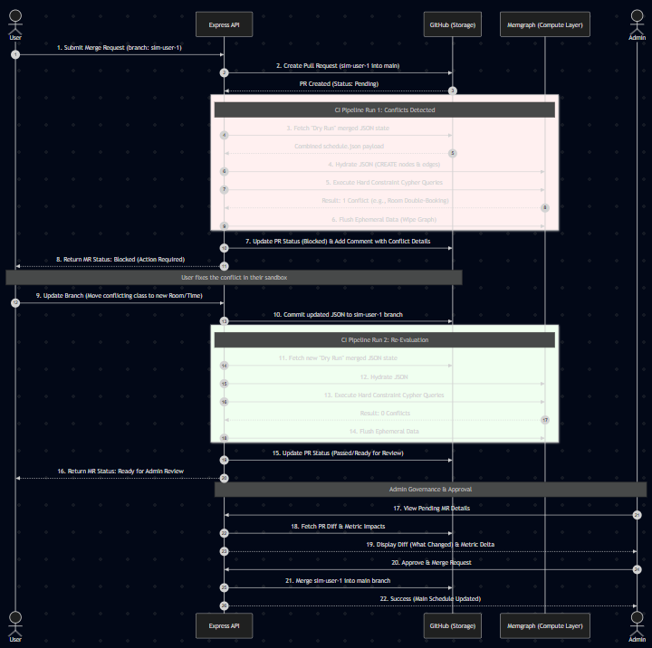

# Sequence Diagram: Merge Request & CI Pipeline
*University Scheduling System - "Blocked PR" Workflow*

## 1. Overview
This sequence diagram maps the flow of data across the four primary actors in our system (Frontend UI, Express API, GitHub Storage, and Memgraph Compute) during the most complex user story: submitting a Simulation for review.

We have explicitly chosen the **"Blocked PR" (Option B)** workflow. Instead of outright rejecting a failed simulation, the system flags the open Merge Request (MR) as "Blocked," allowing the user to push incremental fixes to the same request until the CI Pipeline passes.

## 2. Sequence Diagram (Mermaid)

## 3. Step-by-Step Breakdown

### Phase 1: Submission & Initial Failure (Steps 1-8)
When the User submits their simulation, the Express API acts as the orchestrator. It tells GitHub to open a Pull Request, then immediately pulls what the resulting JSON *would* look like if merged. It hydrates Memgraph, runs the Cypher constraint checks, and detects a conflict. Memgraph is immediately flushed to save memory, and GitHub is updated to show the PR as blocked.

### Phase 2: The Fix & Re-Evaluation (Steps 9-16)
Because the PR is kept open, the user can easily fix the specific error (e.g., changing a room assignment) without losing the rest of their proposed changes. Pushing this fix triggers the Express API to run the CI Pipeline again. This time, Memgraph returns 0 conflicts, so the API updates GitHub to flag the PR as "Ready for Review."

### Phase 3: Admin Approval (Steps 17-22)
The Admin dashboard only shows MRs that have successfully passed the Memgraph CI Pipeline. The Admin reviews the clean Git diff (made possible by our flat JSON schem