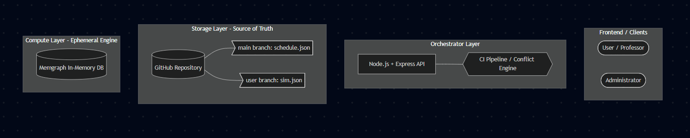

# System Architecture: University Scheduling System
*Human-in-the-Loop Decision Support System for Academic Timetables*

## 1. Project Vision
The University Scheduling System introduces a "Git-flow" architecture to academic timetable management. It acts as a continuous improvement (CI/CD) and change management tool. Users can branch off the main schedule to simulate changes in a sandbox environment and submit their proposals as Merge Requests. The system calculates custom metrics and checks for logical constraints (e.g., double-bookings) to evaluate proposals before they are merged into the "Main Schedule."

---

## 2. High-Level Architecture
To achieve the Git-flow functionality without overwhelming a traditional graph database with complex versioning schemas, the system utilizes an **Ephemeral Hydration Architecture**. 

The system is divided into three distinct layers:

### A. The Storage Layer (Source of Truth)
* **Technology:** GitHub (accessed via GitHub API / `octokit`)
* **Role:** Acts as both the blob storage and version control engine. 
* **Implementation:** The entire university schedule is stored as a structured JSON document. 
    * The `main` branch holds the official, published schedule.
    * User simulations are represented as separate branches (e.g., `sim-user-1`).
    * Proposals are managed natively through Git Pull Requests.

### B. The Compute / Graph Layer (Calculation Engine)
* **Technology:** Memgraph (In-Memory Graph Database)
* **Role:** An ephemeral calculation engine used strictly for evaluating complex relationships, constraints, and metrics.
* **Implementation:** It does *not* act as a persistent database. When a user session requires evaluation (e.g., checking for conflicts or suggesting alternative slots), the JSON state is pulled from GitHub and hydrated into Memgraph. Cypher queries are executed to determine metrics and hard constraints, after which the graph data can be flushed. Memgraph's purely in-memory nature allows for ultra-fast hydration times compared to disk-backed alternatives like Neo4j.

### C. The Orchestrator Layer (Backend API)
* **Technology:** Node.js + Express.js
* **Role:** The brain of the application that bridges the frontend, the GitHub storage, and the Memgraph engine.
* **Implementation:** * Uses `octokit` to pull/push JSON files and manage Git branches.
    * Uses the official `neo4j-driver` (Bolt protocol) to communicate with Memgraph.
    * Manages the "CI Pipeline": When a Merge Request is submitted, the Express API hydrates a temporary graph to run automated Cypher tests for logical conflicts.

---

## 3. Key Architectural Decisions & Trade-offs

### Decision 1: Git/JSON vs. Native Graph Versioning
* **Rationale:** Instead of building a complex delta/diff architecture inside a graph schema (where every edge requires a `branch_id` and override logic), we rely on Git's native version control. 
* **Trade-off:** We incur a "Hydration Penalty" (estimated 10-20 seconds to load a 30,000-class schedule into memory) at the start of a calculation session, but we gain a massively simplified database schema and out-of-the-box version control.

### Decision 2: Ephemeral Memgraph vs. Persistent Neo4j
* **Rationale:** Because the source of truth is in GitHub, the graph database is only needed for momentary Cypher calculations. Neo4j is a heavy, disk-backed database not optimized for constant wiping and reloading of massive datasets. Memgraph operates entirely in RAM and speaks openCypher, making it the perfect drop-in replacement for high-speed ephemeral workloads.

### Decision 3: Omission of Relational DB for User Management
* **Rationale:** To maintain focus on the core demonstration (the scheduling CI/CD pipeline), a standard SQL database for user authentication and state management has been omitted.
* **Implementation:** User roles will be hardcoded. The "Admin" will own the `main` branch, and the "User" will own the simulation branches (e.g., `sim-user-1`). This scopes the demo appropriately without sacrificing the core user stories.

---

## 4. Application Workflows

### 1. Creating a Simulation
1. Frontend requests a new simulation.
2. Express API calls GitHub to branch `main` into `sim-user-1`.
3. The user is now working on their isolated JSON file.

### 2. The Hydration Session (Conflict & Metric Checking)
1. User requests "Smart Suggestions" or impact analysis on their branch.
2. Express API pulls the current JSON from `sim-user-1`.
3. Express API translates the JSON into `CREATE` Cypher queries and executes them via `neo4j-driver` into Memgraph.
4. Express API runs metric calculations (e.g., room utilization) and conflict checks via Cypher.
5. Results are returned to the frontend.

### 3. The Merge Request "CI Pipeline"
1. User submits their simulation for approval.
2. Express API triggers a "dry run" merge of `sim-user-1` into `main`.
3. The combined JSON is hydrated into Memgraph.
4. Express API runs the Hard Constraint Cypher queries.
5. If conflicts > 0, the merge is blocked and the Admin is notified. If 0, the request is flagged as "Safe to Merge".

